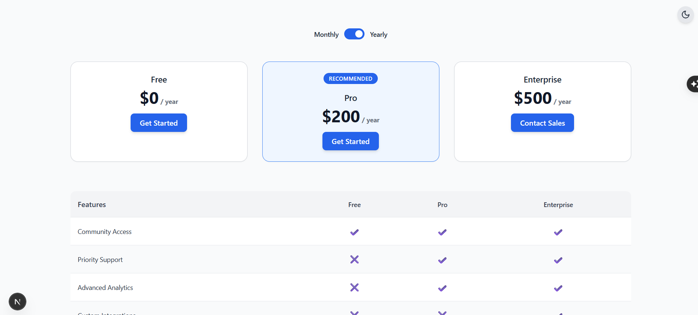
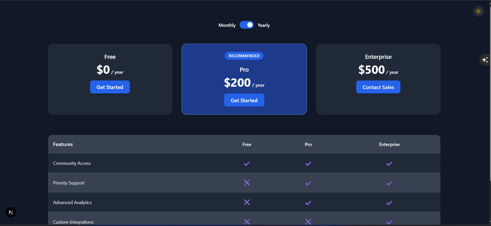

# 💰 Responsive Pricing Table Component (Next.js + Tailwind CSS)

A fully responsive, accessible, and dynamic **Pricing Table UI** built with **Next.js**, **Tailwind CSS**, **Framer Motion**, and **Headless UI**. This component supports **Monthly/Yearly billing toggle**, **dark mode**, and a clear **feature comparison matrix** across three pricing tiers: Free, Pro, and Enterprise.

---

## 🚀 Features

- ✅ 3 Pricing Plans (Free, Pro, Enterprise)  
- ✅ Monthly/Yearly billing toggle  
- ✅ Feature comparison table  
- ✅ Responsive layout (mobile ↔ desktop)  
- ✅ Dark Mode toggle (with persistence)  
- ✅ Framer Motion price animation  
- ✅ Headless UI accessibility  
- ✅ Tailwind-powered design system

---

## 📸 Preview

| 💡 Light Mode                        | 🌑 Dark Mode                       |
| ------------------------------------ | ---------------------------------- |
|  |  |

> _Ensure your `screenshots/` folder contains `light.png` and `dark.png` files._

---

## 🧱 Tech Stack

- [Next.js](https://nextjs.org/)
- [Tailwind CSS](https://tailwindcss.com/)
- [Framer Motion](https://www.framer.com/motion/)
- [Headless UI](https://headlessui.dev/)
- [Lucide Icons](https://lucide.dev/) _(optional)_

---

## 🗂️ Project Structure

pricing-table/
├── components/
│ ├── PricingTable.jsx
│ ├── PlanCard.jsx
│ └── DarkModeToggle.jsx
├── data/
│ └── pricingData.js
├── pages/
│ └── index.js
├── styles/
│ └── globals.css
├── public/
│ └── screenshots/
│ ├── light.png
│ └── dark.png
├── tailwind.config.js
├── postcss.config.js
└── README.md

yaml
Copy
Edit

---

## 📦 Installation & Running Locally

Clone the project and install dependencies:

```bash
git clone [https://github.com/SatyanarayanPatra/pricing-table.git](https://github.com/SatyanarayanPatra/ergobite)
cd pricing-table

# Install dependencies
npm install

# Run the development server
npm run dev
Visit the app in your browser:
🔗 http://localhost:3000

🌐 Live Demo
- 🚀 Live Site: [View on Vercel](https://ergobite.vercel.app/)
- 🌍 GitHub Repo: [SatyanarayanPatra/ergobite](https://github.com/SatyanarayanPatra/ergobite)

⚙️ Customization
You can easily:

Modify pricing plans in data/pricingData.js

Change colors via tailwind.config.js or component classes

Add/remove features per plan

Extend with payment integrations like Stripe

Use your own icons or animations

✨ Accessibility & UX
Keyboard-accessible toggle switch (via Headless UI)

ARIA labels on buttons for screen readers

Dark mode preference saved in localStorage

Smooth transitions and animations with Framer Motion

📄 License
This project is licensed for personal, educational, or demo use. You may adapt and customize it freely.

👨‍💻 Author
Satyanarayan Patra
Frontend Developer

- 🚀 Live Site: [View on Vercel](https://ergobite.vercel.app/)
- 🌍 GitHub Repo: [SatyanarayanPatra/ergobite](https://github.com/SatyanarayanPatra/ergobite)
- 💼 LinkedIn: [Satyanarayan Patra](https://www.linkedin.com/in/satyanarayana-patra-4575b9171/)
- 🌐 GitHub: [SatyanarayanPatra](https://github.com/SatyanarayanPatra)
